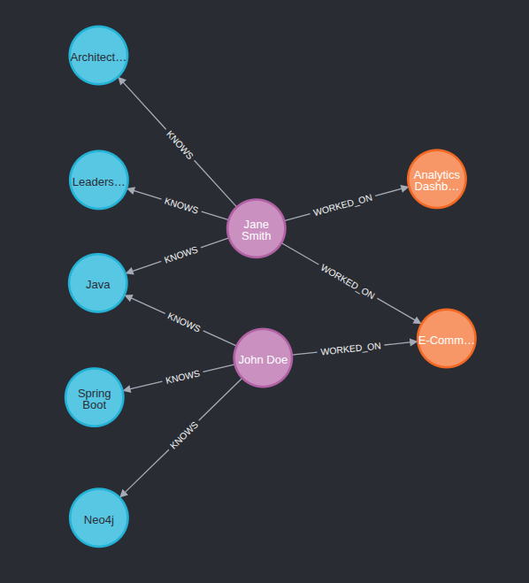
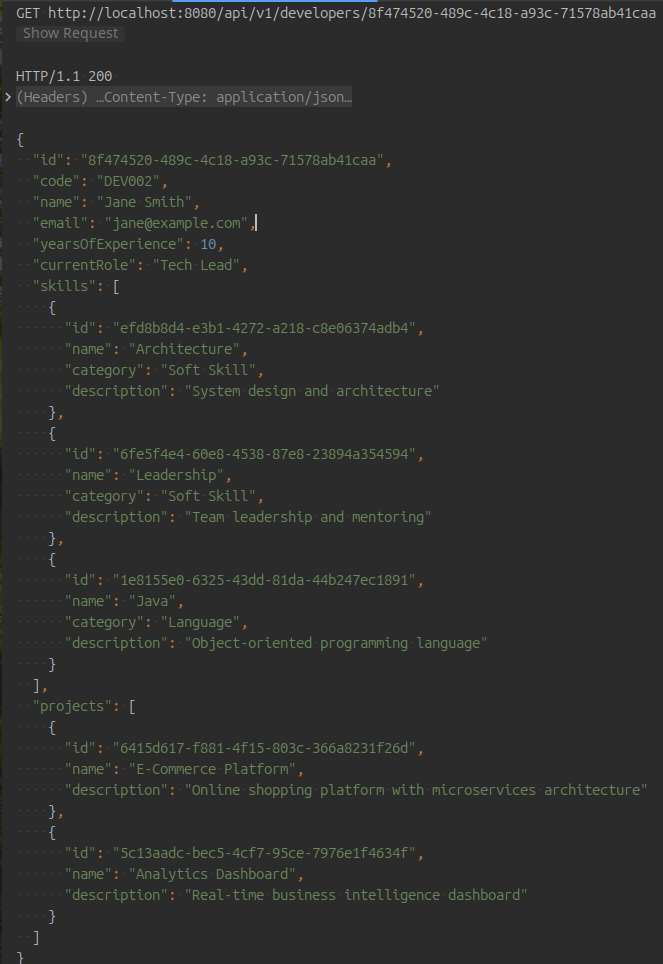
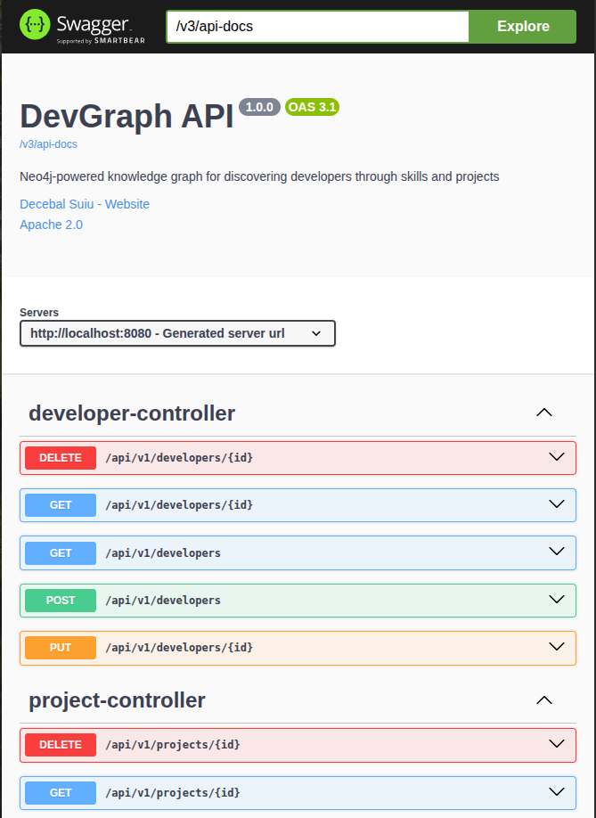

# Developer Skills Network

[](https://github.com/decebals/devgraph/actions/workflows/build.yml)

A graph-based system for discovering, analyzing, and connecting software developers through their skills, projects, and professional relationships.

## Project Purpose

This is a **demonstration project** showcasing:
- Graph database modeling with <a href="https://neo4j.com/" target="_blank">**Neo4j**</a> & <a href="https://www.falkordb.com/" target="_blank">**FalkorDB**</a>
- **Spring Boot** REST API development
- Domain-Driven Design principles
- Incremental development approach

**Target audience**: Technical interview / Portfolio demonstration

## Graph Database Support

This project supports both **Neo4j** and **FalkorDB** to enable:
- Testing and evaluating graph database integration with Java/Spring Boot
- Performance comparison and benchmarking between implementations
- Exploring different graph database technologies

Both databases include complete migration support for schema versioning and data initialization.

**Simple Neo4j version**: A clean, Neo4j-only implementation is available on the [`neo4j-simple-playground`](https://github.com/decebals/devgraph/tree/neo4j-simple-playground) branch for those interested in a simpler starting point.

## Graph Visualization



*Developer knowledge graph showing relationships between developers, skills, and projects*

## API Example

```http request
GET http://localhost:8080/api/v1/developers/8f474520-489c-4c18-a93c-71578ab41caa
```

```json
{
  "id": "8f474520-489c-4c18-a93c-71578ab41caa",
  "code": "DEV002",
  "name": "Jane Smith",
  "email": "jane@example.com",
  "yearsOfExperience": 10,
  "currentRole": "Tech Lead",
  "skills": [
    {
      "id": "efd8b8d4-e3b1-4272-a218-c8e06374adb4",
      "name": "Architecture",
      "category": "Soft Skill",
      "description": "System design and architecture"
    },
    {
      "id": "6fe5f4e4-60e8-4538-87e8-23894a354594",
      "name": "Leadership",
      "category": "Soft Skill",
      "description": "Team leadership and mentoring"
    },
    {
      "id": "1e8155e0-6325-43dd-81da-44b247ec1891",
      "name": "Java",
      "category": "Language",
      "description": "Object-oriented programming language"
    }
  ],
  "projects": [
    {
      "id": "6415d617-f881-4f15-803c-366a8231f26d",
      "name": "E-Commerce Platform",
      "description": "Online shopping platform with microservices architecture"
    },
    {
      "id": "5c13aadc-bec5-4cf7-95ce-7976e1f4634f",
      "name": "Analytics Dashboard",
      "description": "Real-time business intelligence dashboard"
    }
  ]
}
```



## API Documentation

The REST API is documented using OpenAPI 3.0 specification with Swagger UI for interactive exploration.

### Accessing the Documentation

Start the application in development mode with your preferred database:
```bash
./mvnw spring-boot:run -Dspring-boot.run.profiles=dev,neo4j
# OR
./mvnw spring-boot:run -Dspring-boot.run.profiles=dev,falkordb
```

Then access:
- **Swagger UI**: http://localhost:8080/swagger-ui.html (interactive API testing)
- **OpenAPI JSON**: http://localhost:8080/v3/api-docs (machine-readable spec)



*Interactive API documentation with Swagger UI*

### Available Endpoints

- `GET /api/v1/developers` - List all developers
- `GET /api/v1/developers/{id}` - Get developer with skills and projects
- `GET /api/v1/skills` - List all skills
- `GET /api/v1/projects` - List all projects

See Swagger UI for full details.

**Note**: API documentation is disabled in production for security.

### Monitoring

Health check endpoint is available via Spring Boot Actuator:
```bash
curl http://localhost:8080/actuator/health
```

## Quick Start

```bash
# Clone the repository
git clone https://github.com/decebals/devgraph.git
cd devgraph

# Configure environment (required for Neo4j authentication)
cp .env.example .env
# Edit .env and set NEO4J_USER and NEO4J_PASSWORD

# Start both graph databases (Docker)
docker-compose up -d

# Run the application with Neo4j
./mvnw spring-boot:run -Dspring-boot.run.profiles=dev,neo4j

# OR run with FalkorDB
./mvnw spring-boot:run -Dspring-boot.run.profiles=dev,falkordb

# Access the API
curl http://localhost:8080/api/v1/developers
```

**Note**: The application connects to one database at a time based on the active Spring profile (`neo4j` or `falkordb`).

## Tech Stack

- **Java 25** - Programming language
- **Spring Boot 3.x** - Application framework
- **Graph Databases**:
  - **Neo4j 5.x** - Native graph database
  - **FalkorDB** - Redis-based graph database
- **Spring Data**:
  - **Neo4j** - Graph database integration (for Neo4j profile)
  - **FalkorDB** - Graph database integration (for FalkorDB profile) (experimental)
- **Database Abstraction Layer** - Multi-database support with profile-based configuration
- **Database Migrations**:
  - **Neo4j** - Neo4j Migrations library
  - **FalkorDB** - Custom Cypher-based migration system
- **MapStruct** - Object mapping (DTOs)
- **Maven** - Build tool
- **Docker** - Containerization (for graph databases)
- **Swagger/OpenAPI** - API documentation
- **Testing**: JUnit 5, Testcontainers, AssertJ

## Learning Objectives

Through this project, you'll explore:
1. When and why to use a graph database
2. Graph modeling vs relational modeling
3. Cypher query language
4. Graph database integration with Spring Boot (Neo4j & FalkorDB)
5. REST API design for graph data

## Core Concepts

```
(Developer)-[:KNOWS]->(Skill)
(Developer)-[:WORKS_ON]->(Project)
```

## Use Cases

1. **Find developers by skills** - Search for specific skill combinations
2. **Discover similar developers** - Based on skill overlap and project history
3. **Recommend next skill** - Based on career progression patterns
4. **Analyze skills gaps** - For teams and projects
5. **Build optimal teams** - Based on complementary skills and collaboration history

## Development Approach

This project follows an **incremental development model**:

- [x] Dockerized graph database setup (Neo4j & FalkorDB)
- [x] Multi-database abstraction layer
- [x] Core domain model + basic CRUD operations
- [x] Graph queries and relationship traversals
- [x] Swagger/OpenAPI Rest API documentation
- [x] Monitoring and health checks
- [x] Polish, testing, and documentation
- [ ] Advanced queries and recommendations
- [ ] Performance benchmarking between databases

## Not covered

- Authentication/Authorization
- Frontend/UI
- Extensive testing
- Performance optimization
- Extensive monitoring/logging
- Deployment/Scaling

## Contributing

This is a learning/demonstration project. Feel free to fork and experiment!
